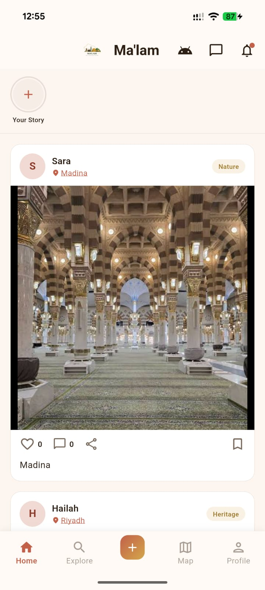
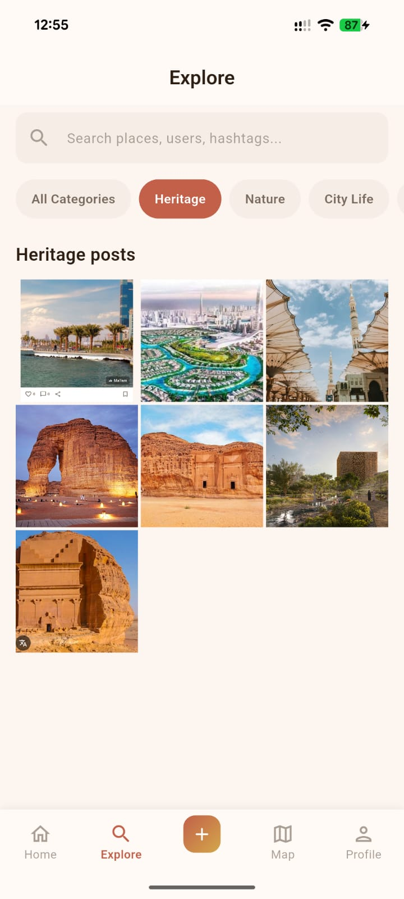
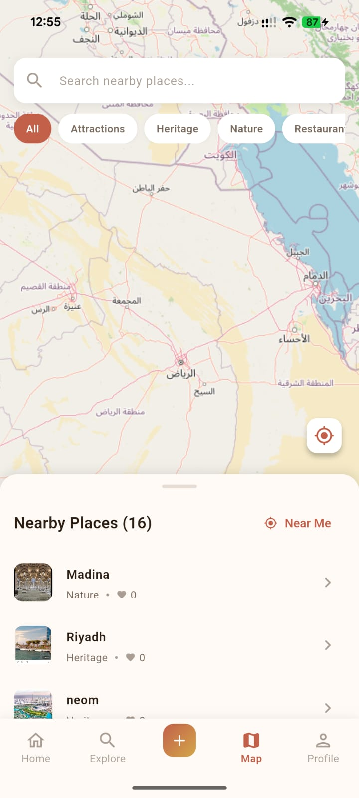
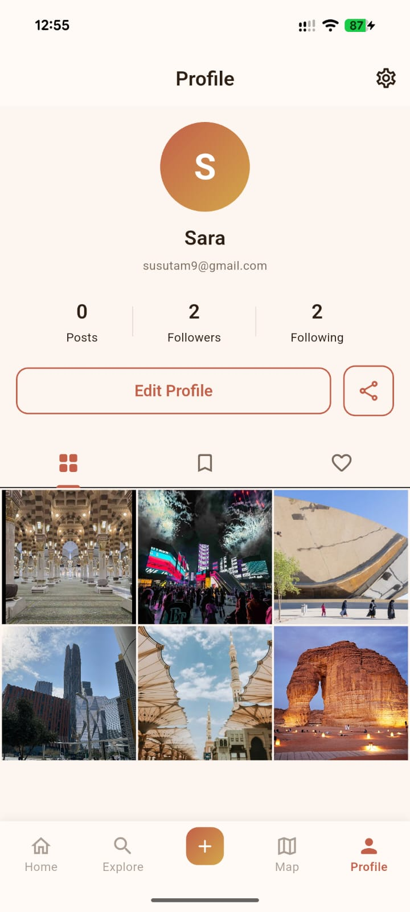
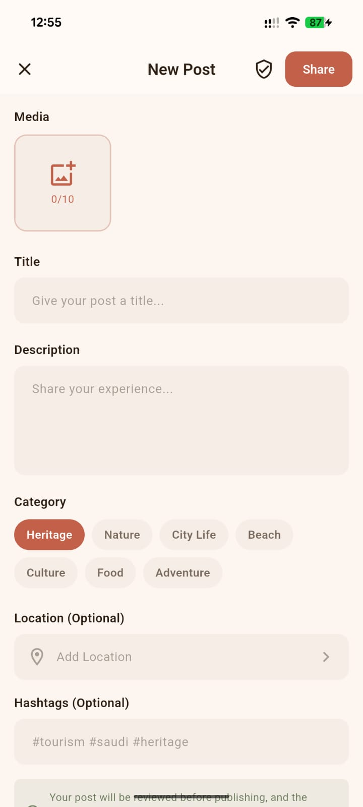
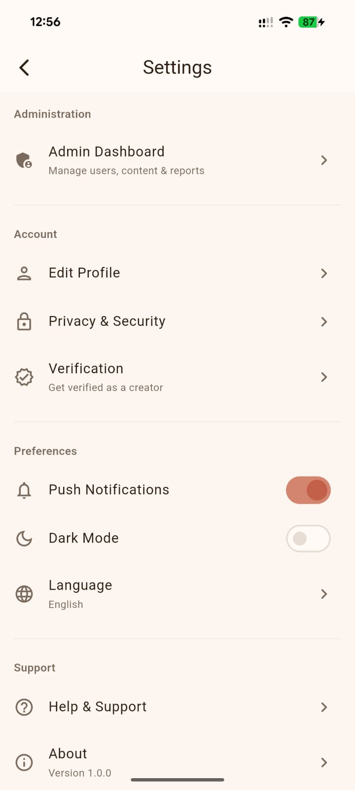

# Ma'lam (معلم)

<p align="center">
  
</p>

<p align="center">
  <strong>Discover Saudi Arabia</strong><br>
  A secure media platform for sharing and exploring verified content showcasing Saudi cities and tourist attractions.
</p>

<p align="center">
  <a href="#features">Features</a> •
  <a href="#screenshots">Screenshots</a> •
  <a href="#installation">Installation</a> •
  <a href="#architecture">Architecture</a> •
  <a href="#contributing">Contributing</a>
</p>

---

## About

**Ma'lam** (معلم - meaning "landmark" in Arabic) is a mobile-first Flutter application designed to promote Saudi tourism and cultural heritage. The platform enables users to share authentic experiences, discover hidden gems, and connect with a community passionate about exploring the Kingdom of Saudi Arabia.

Built in alignment with **Saudi Vision 2030**, Ma'lam supports the goal of welcoming 100+ million annual visitors by providing a centralized, verified platform for authentic Saudi tourism content.

## Features

### Core Features

- **User Authentication** — Email/phone registration with OTP verification, social login (Google, Apple)
- **Content Sharing** — Upload photos/videos with location tagging, categories, and hashtags
- **Discovery Feed** — Personalized home feed with trending content and stories
- **Interactive Map** — Explore nearby attractions and points of interest
- **Search & Explore** — Find users, posts, and places with advanced filters
- **Social Engagement** — Like, comment, share, follow, and bookmark content

### User Features

- **Profile Management** — Customizable profiles with verification badges for creators
- **Story Sharing** — Share ephemeral content showcasing real-time experiences
- **Notifications** — Stay updated with likes, comments, follows, and mentions
- **Bookmarks** — Save posts for later viewing

### Content Features

- **City Profiles** — Dedicated pages for Saudi cities with stats and attractions
- **Attraction Details** — Comprehensive information including hours, contact, and reviews
- **Location Picker** — Tag exact locations when creating posts
- **Multi-image Posts** — Share up to 10 images per post

### Safety & Moderation

- **Content Reporting** — Report inappropriate content with detailed reason selection
- **User Blocking** — Block users for a safer experience
- **Verification System** — Request creator verification for authenticity

### Admin Panel

- **Dashboard Analytics** — Overview of platform statistics
- **User Management** — Manage users, roles, and verification requests
- **Content Moderation** — Review and approve/reject pending content
- **Report Handling** — Process user reports efficiently
- **Location Management** — Add and manage cities and attractions

## Screenshots

<p align="center">
  
  
  
  
  
  
</p>

## Tech Stack

| Layer | Technology |
|-------|------------|
| **Framework** | Flutter 3.9+ (Dart) |
| **State Management** | Provider / Riverpod (planned) |
| **Backend** | Firebase (planned) |
| **Database** | Cloud Firestore (planned) |
| **Storage** | Firebase Storage (planned) |
| **Authentication** | Firebase Auth (planned) |
| **Maps** | Google Maps SDK (planned) |
| **Push Notifications** | Firebase Cloud Messaging (planned) |
| **Content Moderation** | Google Cloud Vision API (planned) |

## Project Structure

```
lib/
├── main.dart                          # Application entry point
├── core/
│   └── theme/
│       ├── app_colors.dart            # Color palette definitions
│       ├── app_text_styles.dart       # Typography styles
│       └── app_theme.dart             # ThemeData configuration
├── navigation/
│   └── app_navigation.dart            # Route definitions and navigation
└── features/
    ├── admin/
    │   └── screens/
    │       └── admin_dashboard_screen.dart
    ├── attraction/
    │   └── screens/
    │       └── attraction_detail_screen.dart
    ├── auth/
    │   └── screens/
    │       ├── forgot_password_screen.dart
    │       ├── login_screen.dart
    │       ├── otp_verification_screen.dart
    │       └── register_screen.dart
    ├── city/
    │   └── screens/
    │       └── city_screen.dart
    ├── common/
    │   └── widgets/
    │       ├── app_dialogs.dart
    │       ├── image_gallery_viewer.dart
    │       ├── loading_widgets.dart
    │       ├── report_sheet.dart
    │       └── state_widgets.dart
    ├── create_post/
    │   └── screens/
    │       ├── create_post_screen.dart
    │       └── location_picker_screen.dart
    ├── home/
    │   ├── screens/
    │   │   ├── home_screen.dart
    │   │   └── main_shell.dart
    │   └── widgets/
    │       ├── post_card.dart
    │       └── story_bar.dart
    ├── map/
    │   └── screens/
    │       └── map_screen.dart
    ├── notifications/
    │   └── screens/
    │       └── notifications_screen.dart
    ├── onboarding/
    │   └── screens/
    │       └── onboarding_screen.dart
    ├── post/
    │   ├── screens/
    │   │   └── post_detail_screen.dart
    │   └── widgets/
    │       └── comments_sheet.dart
    ├── profile/
    │   └── screens/
    │       ├── edit_profile_screen.dart
    │       ├── followers_screen.dart
    │       ├── profile_screen.dart
    │       ├── user_profile_screen.dart
    │       └── verification_request_screen.dart
    ├── search/
    │   └── screens/
    │       ├── search_results_screen.dart
    │       └── search_screen.dart
    ├── settings/
    │   └── screens/
    │       └── settings_screen.dart
    ├── splash/
    │   └── splash_screen.dart
    └── story/
        └── screens/
            └── story_viewer_screen.dart
```

## Design System

### Color Palette

| Color | Hex | Usage |
|-------|-----|-------|
| **Primary** | `#C2604A` | Rich Terracotta - Main brand color |
| **Secondary** | `#D4A74A` | Desert Gold - Accent elements |
| **Accent** | `#6B2D5B` | Deep Plum - Highlights |
| **Background** | `#FDF6F0` | Warm Cream - App background |
| **Text Primary** | `#2D1F14` | Dark Espresso - Main text |

The color scheme draws inspiration from the Saudi Arabian desert landscape, featuring warm, earthy tones that evoke the beauty of the Kingdom's natural heritage.

## Installation

### Prerequisites

- Flutter SDK 3.9.0 or higher
- Dart SDK 3.0.0 or higher
- Android Studio / VS Code with Flutter extensions
- Xcode (for iOS development)

### Setup

1. **Clone the repository**
   ```bash
   git clone https://github.com/yourusername/malam.git
   cd malam
   ```

2. **Install dependencies**
   ```bash
   flutter pub get
   ```

3. **Run the application**
   ```bash
   flutter run
   ```

### Build

```bash
# Android APK
flutter build apk --release

# Android App Bundle
flutter build appbundle --release

# iOS
flutter build ios --release
```

## Configuration

### Environment Setup (Planned)

Create a `.env` file in the root directory:

```env
FIREBASE_API_KEY=your_api_key
GOOGLE_MAPS_API_KEY=your_maps_key
```

### Firebase Setup (Planned)

1. Create a Firebase project at [Firebase Console](https://console.firebase.google.com)
2. Add Android and iOS apps to your Firebase project
3. Download and add configuration files:
   - `google-services.json` for Android
   - `GoogleService-Info.plist` for iOS

## Roadmap

- [x] UI Scaffold (22 screens)
- [x] Custom theme with desert-inspired palette
- [x] Navigation with named routes
- [x] Reusable components (loading states, dialogs, etc.)
- [ ] Firebase integration (Auth, Firestore, Storage)
- [ ] State management implementation
- [ ] Real data models and repositories
- [ ] Google Maps integration
- [ ] Image picker and upload functionality
- [ ] Push notifications
- [ ] RTL/Arabic language support
- [ ] Content moderation system
- [ ] Performance optimization
- [ ] App store deployment

## Contributing

Contributions are welcome! Please read our contributing guidelines before submitting a pull request.

1. Fork the repository
2. Create your feature branch (`git checkout -b feature/AmazingFeature`)
3. Commit your changes (`git commit -m 'Add some AmazingFeature'`)
4. Push to the branch (`git push origin feature/AmazingFeature`)
5. Open a Pull Request

## License

This project is licensed under the MIT License - see the [LICENSE](LICENSE) file for details.

## Acknowledgments

- Inspired by Saudi Vision 2030 tourism initiatives
- Design influenced by Saudi Arabia's rich cultural heritage
- Built with Flutter and the amazing Flutter community

---

<p align="center">
  Made with ❤️ for Saudi Arabia
</p>

<p align="center">
  <sub>Supporting Saudi Vision 2030</sub>
</p>
